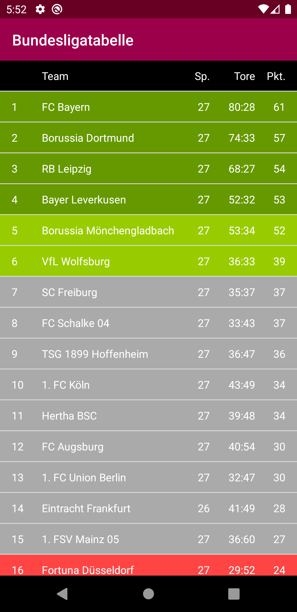
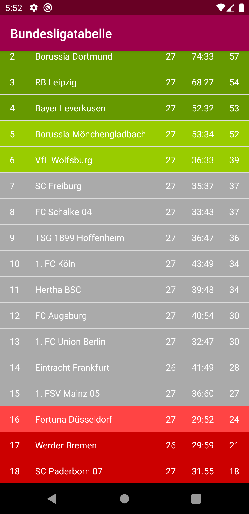

# U08 | Bundesligatabelle


## Downloads

- [Download des Starterpakets](https://github.com/Android-Regensburg/U08-Bundesligatabelle/archive/starter.zip)
- [Download des Lösungsvorschlag](https://github.com/Android-Regensburg/U08-Bundesligatabelle/archive/solution.zip)

## Aufgabe

Das Ziel dieser Aufgabe ist die Implementierung einer App zur Darstellung der (aktuellen) Bundesligatabelle. Um bereits bekannte Konzepte, wie die Darstellung von Informationen in einem ListView und die Bearbeitung bestimmter Aufgaben in einem nebenläufigen Thread, mit den neu erlernten Konzepten der Netzwerkprogrammierung zu verknüpfen, sollen die Bundesligadaten über einen Server (*OpenLigaDB*) bezogen werden.

## Hinweise

* Link zu den aktuellen Bundesligadaten: https://www.openligadb.de/api/getbltable/bl1/2019
* Die Dokumentation zur API finden Sie bei Interesse hier: https://github.com/OpenLigaDB/OpenLigaDB-Samples
* Zum Verarbeiten der Serverantwort (`InputStream`) können Sie einen `BufferedReader` verwenden:
  * `BufferedReader`: https://docs.oracle.com/javase/8/docs/api/java/io/BufferedReader.html
* Die Ligadaten liegen nach dem Herunterladen im `JSON`-Format vor:
  * `JSONArray`: https://developer.android.com/reference/org/json/JSONArray 
  * `JSONObject`: https://developer.android.com/reference/org/json/JSONObject

## Ausgangslage
* Die Layouts für die `TableActivity` und die `ListView`-Items sind bereits vollständig vorgegeben und können ohne weitere Anpassung verwendet werden.
* Alle benötigten Klassen sind bereits erstellt. In einigen Fällen wurden zwar bereits Ansätze eines groben Grundgerüsts umgesetzt, jedoch ist keine der Klassen vollständig implementiert.

## Vorgehen
### Darstellung der Bundesligatabelle.  
Im ersten Teil soll die korrekte Darstellung der Bundesligatabelle umgesetzt werden.
Implementieren Sie zunächst die Klasse `TableItem`, die zur Modellierung eines Tabellenneintrags dient. Die relevanten Informationen (Mannschaftsname, Punkte etc.) sollen hier als Instanzvariablen gehalten und über entsprechende getter-Methoden zugänglich gemacht werden. Für die Auswahl, welche Informationen relevant sind, können sie sich an den Screenshots oder am Aufbau des vorgegebenen `bl_table_item`-Layout orientieren.
Es steht Ihnen natürlich frei herauszufinden, welche weiteren Informationen von *OpenLigaDB* zur Verfügung gestellt werden und die Klasse `TableItem` (sowie das dazugehörige Layout) entsprechend zu erweitern.

Vervollständigen Sie die Klassse `TableItemAdapter`, indem Sie die TextView-Elemente des Listeneintrags in der Methode `getView()` referenzieren und mit den entsprechenden Werten des jeweiligen `TableItem`-Objekts befüllen.
Zusätzlich soll die Hintergrundfarbe des jeweiligen Eintrags abhängig von der Platzierung angepasst werden. Dadurch sollen die Qualifikationsplätze für Champions- und Europa League, sowie die direkten Abstiegsplätze und der Relegationsplatz hervorgehoben werden. Sie können hierfür folgende Standardfarben des Android-Frameworks verwenden:  

* Platz 1-4: `android.R.color.holo_green_dark`  
* Platz 5-6: `android.R.color.holo_green_light`  
* Platz 7-15: `android.R.color.darker_gray`  
* Platz 16: `android.R.color.holo_red_light`  
* Platz 17-18: `android.R.color.holo_red_dark`  

**Hinweis:** Bei diesen `int`-Werten handelt es sich nicht um Farbwerte, sondern um Ressourcen-*Identifier*. Statt der Methode `setBackgroundColor(int color)` der Klasse `View` benötigen wir hier die Methode `setBackgroundResource(int resid)`. 

Vervollständigen Sie anschließend die Implementierung des `ListView` in der `TableActivity`. Folgen Sie dabei dem bekannten Vorgehen zur Verknüpfung von Datenquelle (`ArrayList`) und UI-Element (`ListView`).
Dem `ListView` soll noch eine Kopfzeile hinzugefügt werden (vgl. Screenshot 1). Dafür muss zuerst ein neues `View`-Objekt erstellt werden, indem (wie in der Adapterklasse) das Item-Layout „aufgeblasen“ (engl. *to inflate*) wird.
```
View v = ((LayoutInflater) getSystemService(Context.LAYOUT_INFLATER_SERVICE))
        .inflate(R.layout.bl_table_item, null);
```
Mithilfe der Methode `addHeaderView()` der Klasse `ListView` kann das `View`-Objekt dem `ListView` hinzugefügt werden.  
**Hinweis:** Auch ohne das Holen der Bundesligadaten aus dem Internet implementiert zu haben, können Sie die Funktionalität Ihres `ListView` überprüfen, indem sie zu Testzwecken ein oder zwei `TableItem`-Objekte mit (sinnvollen) Dummywerten erstellen und ihrer Liste hinzufügen.

### Abfrage der Bundesligadaten von *OpenLigaDB*
Im zweiten Teil der Aufgabe sollen nun die Bundesligadaten aus der Onlinequelle bezogen werden.

Für den Zugriff Ihrer Anwendung auf das Internet ist eine entsprechende Berechtigung erforderlich. Überprüfen Sie das `Manifest` der Anwendung und beantragen Sie dort gegebenenfalls die (aus der Vorlesung bekannte) benötigte Berechtigung.

Das Grundgerüst der Klasse `TableDownloadTask` (Konstruktor und Implementiertung des `Runnable`-Interface) ist bereits vorgegeben, Sie können daher bereits die Ausführung des `TableDownloadTask` in `TableActivity` implementieren. Erstellen Sie an geeigneter Stelle in `TableActivity` ein   und führen Sie in einem eigenen Thread aus. Vervollständigen Sie auch die Methode `onDownloadFinished`, die durch das Interface `OnDownloadListener` vorgegeben wird. Hier sollen die Einträge der übergebenen `ArrayList` in die mit dem `ListView` verknüpften Liste übertragen werden.  
**Hinweis:** Überschreiben sie Ihre `ArrayList`-Instanzvariable nicht einfach mit der hier übergebenen Liste, da sonst die Verknüpfung zwischen `ListView` und `ArrayList` aufgebrochen wird.
  
Um die Nebenläufigkeit zu testen, bietet es sich auch hier an, in der `run()`-Methode in `TableDownloadTask` zunächst eine `ArrayList` anzulegen, diese wie zuvor mit ein paar Dummy-`TableItem`-Objekten zu befüllen und anschließend an den `OnDownloadListener` zu übergeben. Das Ansprechen des Listeners soll dabei **nicht mehr nebenläufig, sondern wieder auf dem UI-Thread** stattfinden (vgl. z.B. U06-Telefonbuch).
  
Im letzten Abschnitt soll nun das Herunterladen und Verarbeiten der Bundesligadaten im Rahmen der `run()`-Methode in `TableDownloadTask` implementiert werden.
  
Orientieren Sie sich für den Aufbau der Http-Kommunikation an den Kursmaterialien. Eine einfache Http-Kommunikataion sollte folgendem Ablauf folgen:  

* Aufbau der `HttpUrlConnection` auf Basis eines `URL`-Objekts  
* Festlegung relevanter Verbindungsparameter (z.B. Timeouts, Art der Anfrage)  
* Anfrage an den Server und Überprüfung des Response-Codes  
* Verarbeitung der Serverantwort (hier z.B. mittels `InputStream` und `BufferedReader` zu einem `String`)  
* Schließen der offenen Verbindung
  
Die Bundesligadaten stehen Ihnen nun als (`JSON`-)`String` zur Verfügung. Um zu überprüfen, ob das Herunterladen der Daten funktioniert und um den Aufbau des `JSON-String` nachzuvollziehen, bietet es sich an, den `String` mithilfe der Methoden der `Log`-Klasse in der Konsole ausgeben zu lassen. Bevor Sie die Ligadaten an ihren `OnDownloadListener` übergeben, müssen Sie ihn noch in eine passende Struktur überführen (`ArrayList<TableItem>`). Vervollständigen und nutzen Sie hierfür die statische Methode `parseTableJSONData(String jsonDataString)` der Klasse `TableJSONDataParser`.  
**Hinweis:** Für die Überführung des Strings können Sie sich am Beispiel aus der Vorlesung orientieren, beachten Sie jedoch, dass Ihr heruntergeladener `JSON-String` auf oberster Ebene kein `JSONObject` sondern ein `JSONArray` enthält.

## Anhang
### Screenshots

| | |
|-|-|
|{ height=8cm } |{ height=8cm } |

